# Lab 01 Report

Student: Le Dan Son  
Student ID: 202416749  
Repository: `OOP.Lab.20261.202416749.LeDanSon`

## GitHub repository

`REPLACE_WITH_PUBLIC_GITHUB_REPOSITORY_URL`

The repository should be public and use the `master` or `main` branch, as
specified in the lab guidelines.

## Completed work

- Exercises 2.2.1-2.2.6: first Java applications, arithmetic, and equation solving.
- Exercises 6.1-6.6: option dialogs, keyboard input, star triangle, month/day validation,
  array statistics, and matrix addition.
- Questions: answered in [`answers.txt`](answers.txt).

## Reproducibility

```text
javac -d out src\*.java
```

Representative command-line runs are captured below. The Swing exercises are
verified by their source code and can be run in a desktop environment.

### 2.2.1 HelloWorld

```text
> java -cp out HelloWorld
Xin chao
 cac ban!
Hello 	 world!
```

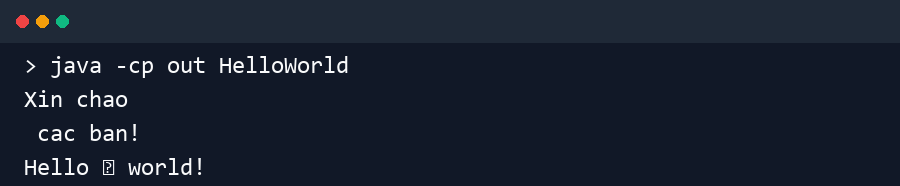

### 2.2.2 FirstDialog

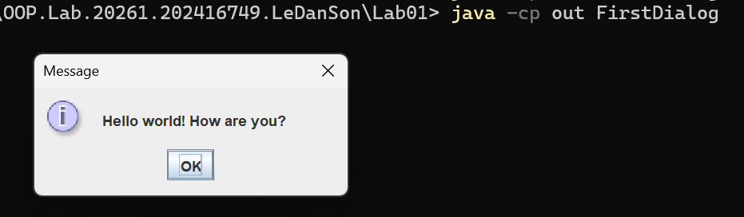

### 2.2.3 HelloNameDialog

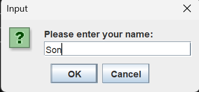


### 2.2.4 ShowTwoNumbers

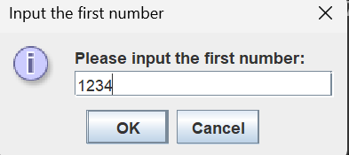

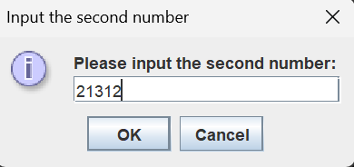

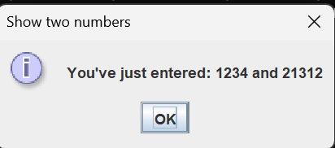

### 2.2.5 BasicOperations

```text
> echo 12.5 2.0 | java -cp out BasicOperations
Enter the first double: Enter the second double: Sum: 14.500000
Difference: 10.500000
Product: 25.000000
Quotient: 6.250000
```

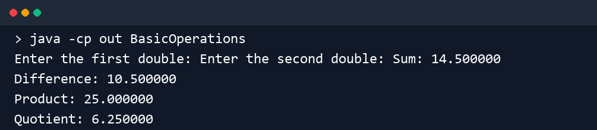

### 2.2.6 EquationSolver

```text
> echo 3 1 -3 2 | java -cp out EquationSolver
Choose an equation type:
1 - First-degree equation ax + b = 0
2 - 2x2 first-degree system
3 - Second-degree equation ax^2 + bx + c = 0
Your choice: Enter a, b, and c: x1 = 2.000000, x2 = 1.000000
```

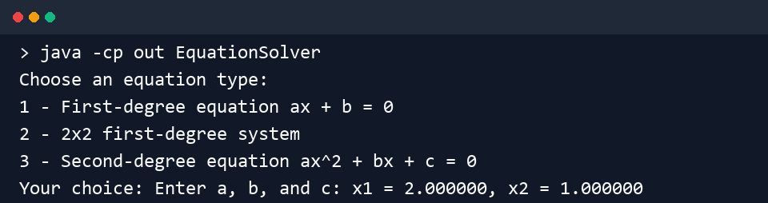

### 6.3 Triangle

```text
> echo 5 | java -cp out Triangle
Enter the height: *
***
*****
*******
*********
```

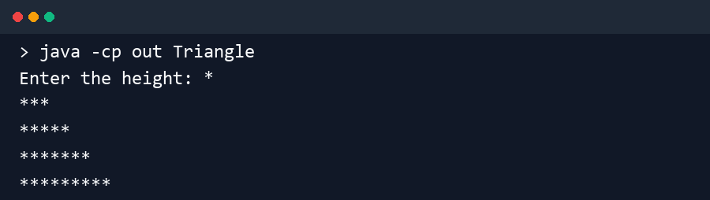

### 6.4 DaysOfMonth

```text
> echo 2 2000 | java -cp out DaysOfMonth
Enter month (name, abbreviation, or number): Enter a non-negative year: february 2000 has 29 days.
```

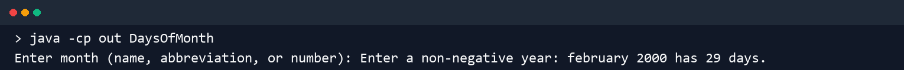

### 6.5 ArrayStatistics

```text
> echo 4 4.5 1.0 3.0 2.5 | java -cp out ArrayStatistics
Enter array length: Enter element 1: Enter element 2: Enter element 3: Enter element 4: Sorted array: [1.0, 2.5, 3.0, 4.5]
Sum: 11.000000
Average: 2.750000
```

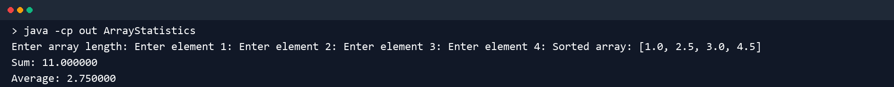

### 6.6 MatrixAddition

```text
> echo 2 2 1 2 3 4 5 6 7 8 | java -cp out MatrixAddition
Enter number of rows: Enter number of columns: Enter the first matrix:
Enter the second matrix:
Sum matrix:
6 8
10 12
```

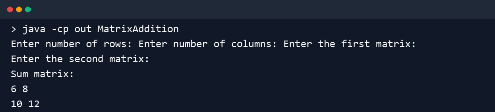

The dialog-based exercises 2.2.2-2.2.4 are implemented in Swing and their
desktop results are included above. Exercise 6.1 is also implemented in Swing
and can be run from a desktop Java environment.
